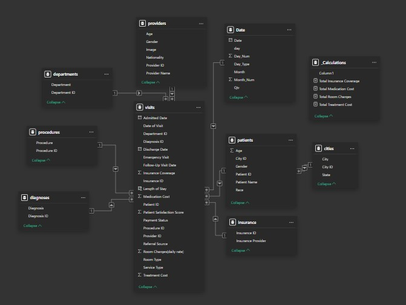

# Healthcare-Analytics
https://github.com/user-attachments/assets/bbe94578-07ca-4e7b-b857-020a66f7852d

# Project Overview
In pursuit of excellence in patient care and operational performance, NovaCare Hospitals aims to enhance operational efficiency by analyzing key processes across admissions, billing, and follow-up workflows. This project consolidates data from various departments, including admissions, billing, and follow-up services, to provide a holistic view of hospital operations. 

# Data Description
The NovaCare Hospitals dataset is structured to represent core hospital operations and clinical workflows. It includes patient visits, diagnoses, procedures, billing, and provider details, enabling deep analytical insights through Power BI.

### patients
Contains demographic data of patients.
- `Patient ID`, `Patient Name`, `Age`, `Gender`, `City ID`

### date
Calendar table for time intelligence in reporting.
- `Date`, `Day_Num`, `Day_Type`, `Month`, `Month_Num`

### visits
Central fact table capturing hospital visit data.
- `Admitted Date`, `Discharge Date`, `Diagnosis ID`, `Procedure ID`, `Department ID`, `Insurance ID`
- `Length of Stay`, `Treatment Cost`, `Medication Cost`, `Room Charges`
- `Insurance Coverage`, `Referral Source`, `Service Type`, `Payment Status`
- `Patient Satisfaction Score`

### Insurance
Provides insurance-related metadata.
- `Insurance ID`, `Insurance Provider`

### Departments
Describes hospital departments.
- `Department ID`, `Department`

### Procedures
Defines procedures performed during patient visits.
- `Procedure ID`, `Procedure`

### Diagnoses
Stores diagnosis information.
- `Diagnosis ID`, `Diagnosis`

### Providers
Captures details about healthcare providers.
- `Provider ID`, `Provider Name`, `Age`, `Gender`, `Nationality`

### Cities
Geographic dimension for mapping patients.
- `City ID`, `City`, `State`

### _calculations
This table contains all custom **DAX measures** used in analysis.
- `Total Treatment Cost`, `Total Medication Cost`, `Total Insurance Coverage`, `Total Room Charges`, etc.

# Data Exploration and Analysis

An in-depth exploration was carried out to understand and evaluate multiple facets of hospital operations, focusing on patient journeys, provider performance, service efficiency, and financial health. The analysis was structured across several dimensions:

## Patient Demographics
- Age, gender, and city-wise distributions were examined to profile the hospital’s patient base.
- Patterns in referrals were analyzed using the `Referral Source` and `Referral Type` fields to identify major intake channels.
- Geographic spread was evaluated by linking the `Cities` table with patient information, highlighting key urban areas driving hospital footfall.

## Visit and Operational Insights
- Temporal trends were explored using the `Date` table and fields like `Admitted Date`, `Discharge Date`, and `Follow-up Visit Date` to identify peak admission days, lengths of stay, and follow-up gaps.
- Key operational KPIs such as `Room Charges`, `Medication Cost`, `Insurance Coverage`, and `Treatment Cost` were broken down by `Department`, `Diagnosis`, `Procedure`, and `Service Type`.
- Analysis of `Patient Satisfaction Score` and `Treatment Satisfaction Score` helped uncover quality-of-care issues and provider-level variations.
- Room type and service type utilization rates were tracked to assess capacity planning and resource optimization.

## Billing and Insurance Analysis
- Patient billing data was dissected using the `Insurance`, `Treatment Cost`, and `Medication Cost` fields to understand payer mix and cost drivers.
- The DAX-powered `Calculations` table helped compute aggregated values such as `Total Insurance Coverage`, `Total Room Charges`, `Total Medication Cost`, and `Total Treatment Cost`.
- Payment statuses and insurance coverage levels were evaluated across departments and diagnoses to detect collection delays or underinsured segments.

## Provider and Department-Level Analysis
- Provider profiles were segmented by gender, age, and nationality to ensure diversity in staffing.
- Department-wise analysis focused on procedure frequency, diagnosis types, patient throughput, and cost efficiency.
- Provider-level performance was assessed using patient satisfaction metrics and number of visits attended.

## Advanced Drilldowns and Cross Filtering
- Interactive reports enabled dynamic filtering by department, diagnosis, city, and insurance provider to reveal granular trends.
- All analysis was driven by relationships established in the data model across fact and dimension tables (Visits, Patients, Providers, Procedures, Insurance, etc.).

Here’s a glimpse into some of the DAX logic used to uncover patterns and trends in the data.
| 🔍 Analysis Focus | 📝 Description | 💡 DAX Logic |
|------------------|----------------|--------------|
| **First-Time Visits** | Counted how many patients were visiting for the first time by identifying the minimum visit date per patient. | First Time Visits = COUNTROWS(FILTER(visits, visits[Date of Visit] = CALCULATE(MIN(visits[Date of Visit]), ALLEXCEPT(visits, visits[Patient ID])))) |
| **Most Common Gender** | Analyzed which gender had the most distinct patients visiting. Useful for demographic profiling. | Most Common Gender = VAR GENDERTABLE = ADDCOLUMNS(VALUES(patients[Gender]), "PatientCount", CALCULATE(DISTINCTCOUNT(patients[Patient ID]))) VAR TopGender = TOPN(1, GENDERTABLE, [PatientCount], DESC) RETURN MAXX(TopGender, patients[Gender]) |
| **Follow-Up Visit Interval** | Calculated the average time (in days) between a patient's initial and follow-up visit to assess continuity of care. | AVERAGEX(FILTER(visits, NOT(ISBLANK(visits[Date of Visit])) && NOT(ISBLANK(visits[Follow-Up Visit Date]))), DATEDIFF(visits[Date of Visit], visits[Follow-Up Visit Date], DAY)) |
| **Billing by Procedure** | Measured how much each procedure contributed to total billing to track high-revenue treatments. | DIVIDE([Total Billing Amount], CALCULATE([Total Billing Amount], ALL(procedures[Procedure]))) |

All calculations were implemented in the _calculations table and surfaced through clean KPI visuals, bar charts, and cards across the Power BI report.
[Download the Power BI report](Healthcare_analytics_Final_Report.pbix)

# Observations
- NovaCare sustains ~20 patient visits per day, with a 75/25 split between outpatient and inpatient throughput.
- The emergency department processes ~8 visits daily, yet inpatient admission rate stays at ~25%.
- One‑third of visits originate from self‑referrals, highlighting strong direct‑to‑patient engagement compared to 25% physician referrals.
- Imaging workload remains skewed: Orthopedics accounts for 60% of CT scan utilization, while other specialties share the remaining 40%.
- Billing time‑series analysis reveals stable monthly revenue (~£190K) with a pronounced 47% decline in October collections.
- Accounts receivable data shows 30–40% of invoices remain outstanding beyond 30 days, pointing to collection cycle inefficiencies.
- The specialty-wise visit distribution shows Cardiology and Orthopedics as the top service lines, accounting for over 50% of all encounters.
- Revenue contribution analysis shows Radiology and Surgery jointly account for over 60% of monthly billing, indicating high procedural dependency.
